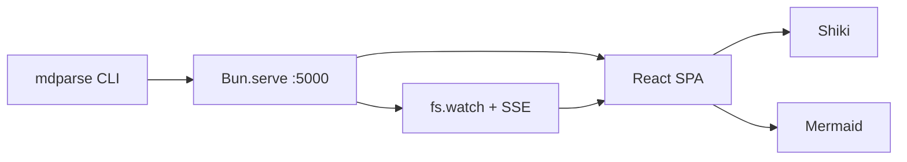
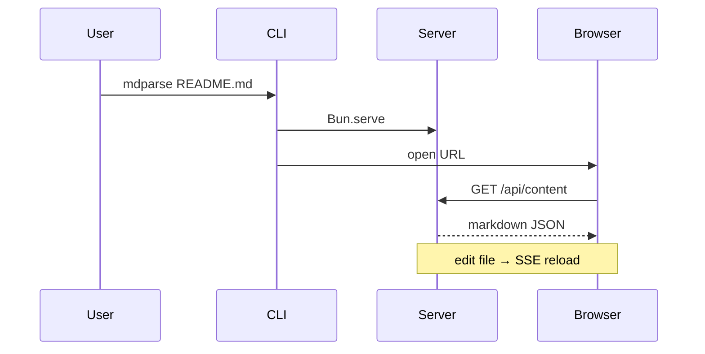

# mdparse sample

A fixture for verifying **GFM**, code highlighting, tables, and Mermaid diagrams.

## Features

- Live reload when this file changes
- Vercel **Geist** theme + shadcn-style chrome
- Syntax highlighting (Shiki)
- Mermaid graphs
- Relative images under `/media/`

### Task list

- [x] Scaffold Bun CLI
- [x] Serve on `localhost:5000`
- [ ] Add more themes later

## Code

Inline: `const x = 1`

```ts
export function greet(name: string): string {
  return `Hello, ${name}!`;
}

console.log(greet("mdparse"));
```

```bash
bun run src/cli.ts fixtures/sample.md
# → http://127.0.0.1:5000
```

## Table

| Feature   | Status | Notes                |
| --------- | ------ | -------------------- |
| GFM       | Yes    | remark-gfm           |
| Shiki     | Yes    | github-light/dark    |
| Mermaid   | Yes    | theme-aware          |
| Live SSE  | Yes    | file watch + reload  |

## Mermaid





## Quote

> Good design is as little design as possible — but the details matter.

## Links

- [CommonMark](https://commonmark.org)
- [Vercel Geist](https://vercel.com/geist/)
- [shadcn/ui](https://ui.shadcn.com)

---

End of sample.
